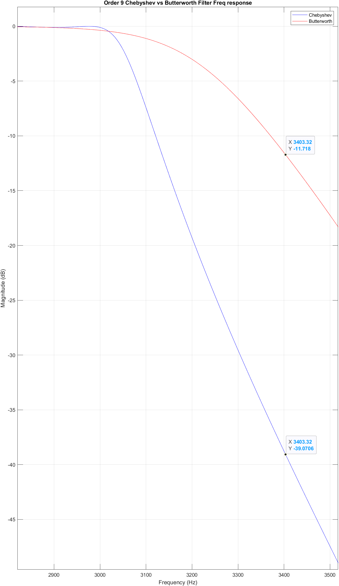
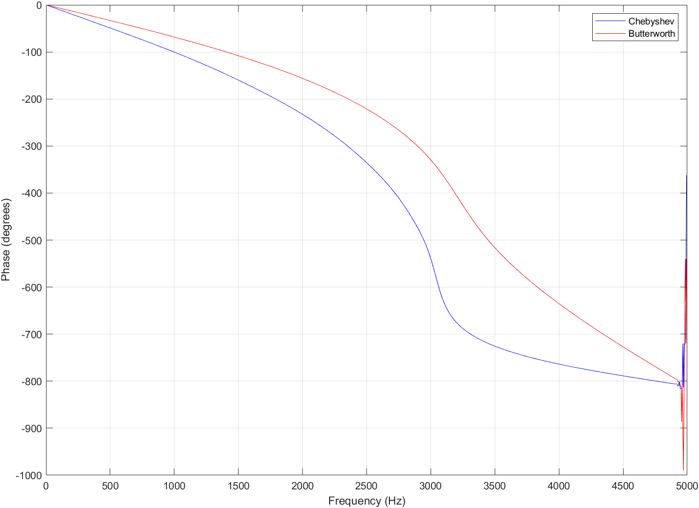

## Question 1 - IIR Filter
Using the `cheby1`, `cheb1ord` and `butter` functions build a chebyshev low pass filter matching the following specifications and an equival butterworth of the same order.
*Specifications:*
- Sampling Freq: Fsamp: 10Khz
- Cutoff Freq: Fc: 3khz
- Transition BW: 400hz
- Freq sampled: Fs: 3.4khz
- Stop Band Attenuation: 35dB: i.e. 35dB @ 3.4khz
- Pass band Ripple: 0.1dB

*Butterworth Alignment:*
There are two main ways to align the Butterworth filter with the Chebyshev,
1) Set the cutoff frequency the same for each frequency.
2) Have the 0dB attenuation move at the same point. i.e 3000hz before the filters drop.

Cutoff frequencies are calculated slightly differently for a Chebyshev and Butterworth, where Chebyshev has the cutoff frequency as the point of the last ripple and butterworth has the cutoff frequency as the point where the function hits -3dB.
The graphs below show the two different options, one with butter cutoff at 3000hz and one with butter cutoff at 3200hz to align the attenuation points.

The Butterworth filter hits -3dB at 3000hz in the image above. This function reaches the transistion bandwidth closer than than the below option.


The Butterworth filter hits -0.35dB at 3000hz. The 2 functions match with attenuation drop off at the same points. This allows for better comparisons with how quickly the functions drop off.

The second option will be used for comparison purposes to keep the attenuations comparable.

*Filter Sharpness*

The above image shows how much both filters have attenuated at the transistion bandwidth point. The difference is 27dB or an absolute magnitude of 500x.

*Pass Band distortion*


The images above show the ripple amplitude in the pass band and the phase distortion of the two filters respectively. The Chebyshev has much steeper phase distortions than the Butterworth.
``` MATLAB
clear;
Fsamp = 10e3;
Fc = 3e3;
Fs = 34e2;
Wc = Fc/(Fsamp/2);
Ws = Fs/(Fsamp/2);
Wb = (Fc+200)/(Fsamp/2);
ftb = 400;
Stop_att = 35;
Pass_rip = 0.1;
[n, Wp] = cheb1ord(Wc, Ws, Pass_rip, Stop_att);

[b,a] = cheby1(n , Pass_rip, Wp);
[c, d] = butter(n, Wb);

[H1, W1] = freqz(b, a, 1024);
[H2, W2] = freqz(c, d, 1024);

F1 = W1*Fsamp/(2*pi);
mag1_db = 20*log10(abs(H1));

F2 = W2*Fsamp/(2*pi);
mag2_db = 20*log10(abs(H2));

% Calculate phase responses in degrees
phase1 = unwrap(angle(H1))*180/pi;
phase2 = unwrap(angle(H2))*180/pi;

% Create subplot layout
subplot(2,1,1);
plot(F1, mag1_db, 'blue');
hold on;
plot(F2, mag2_db, 'red');
hold off;
grid on;
xlabel('Frequency (Hz)');
ylabel('Magnitude (dB)');
title('Order 9 Chebyshev vs Butterworth Filter Response');
legend(["Chebyshev", "Butterworth"]);

subplot(2,1,2);
plot(F1, phase1, 'blue');
hold on;
plot(F2, phase2, 'red');
hold off;
grid on;
xlabel('Frequency (Hz)');
ylabel('Phase (degrees)');
legend(["Chebyshev", "Butterworth"]);
```
## Question 2 - FIR Filter
Using the `firpm`and `fir1` functions design a digital low pass filter with the following specifications:
- Sampling Frequency: Fsamp: 8kHz
- Cutoff Frequency: Fc: 2kHz
- Transition Bandwidth: 300Hz
- Stopband Gain: 0 (Desired)

*Transition bandwidth*

The graph above shows the transition bandwidths for both the firpm function and the fir1 function with the same order.
**firpm:**
- Bandwidth: ~450Hz
- Attenuation difference: ~2.6dB

**fir1**
- Bandwidth: ~765Hz
- Attenuation difference: ~54dB

Both filters have their own merit, with the `firpm` filter having a narrower transition bandwidth but attenuation difference not as steep as the `fir1` filter. The attenuation for each ripple after the first ripple is larger for the `firpm`filter compared to the `fir1` filter. 

Finite impulse response filters have a linear phase property, which can be given by the following function for even order N:
$ \phi(\omega) = -(N/2 +1)\omega$