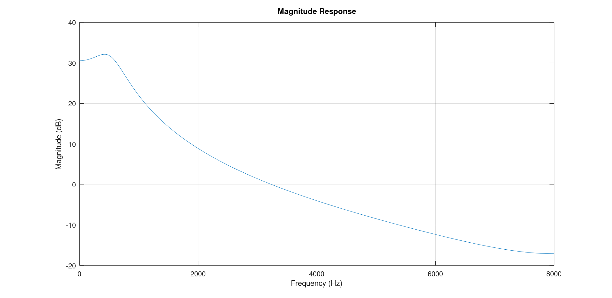
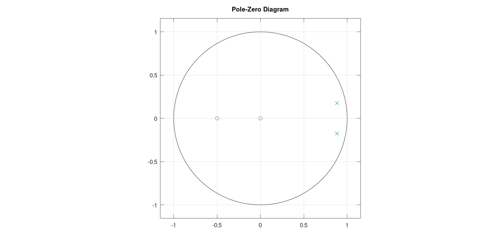
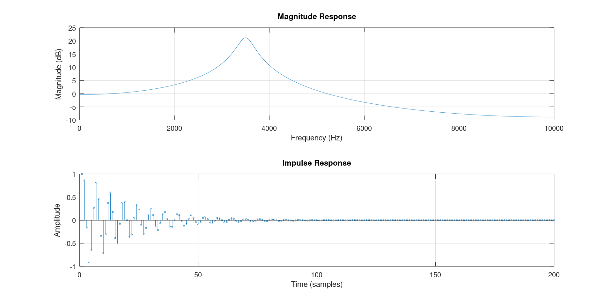
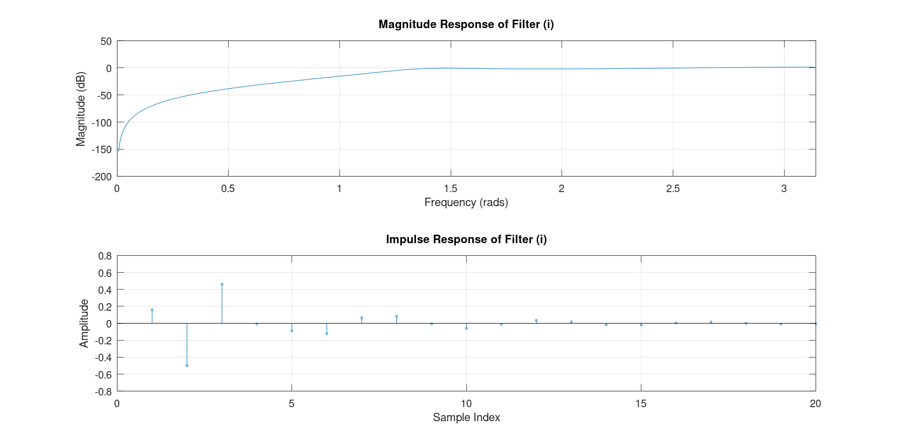
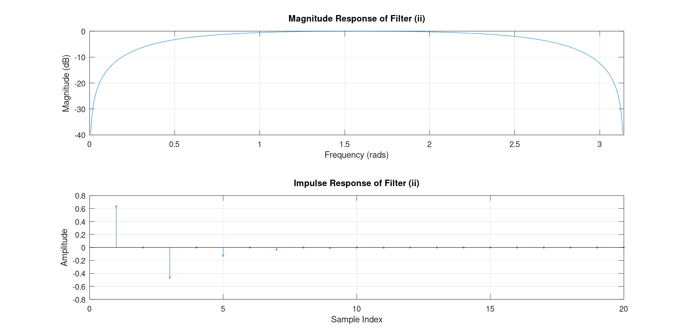
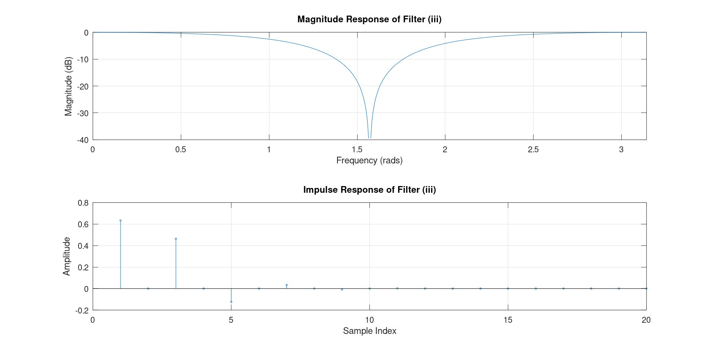
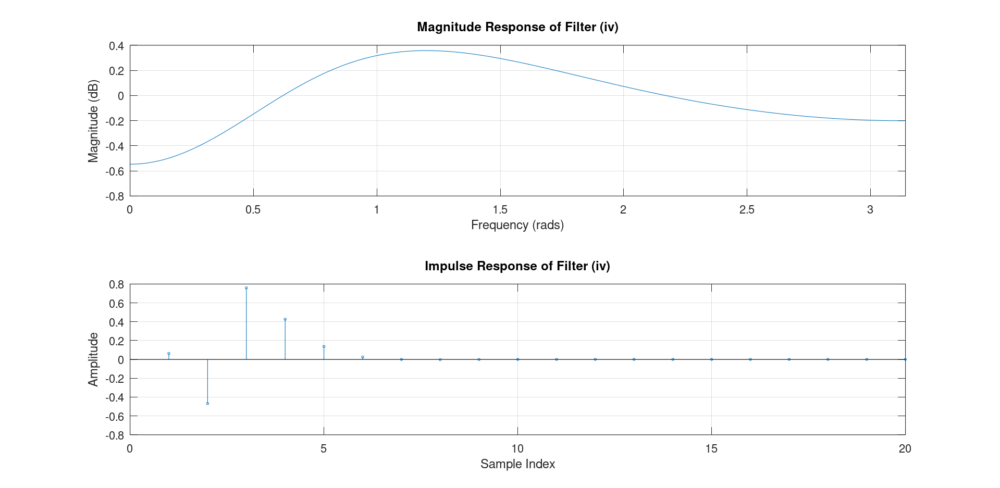
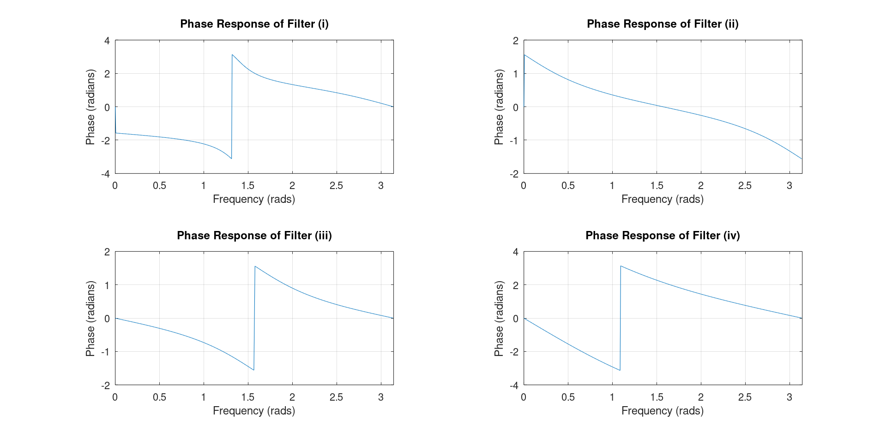
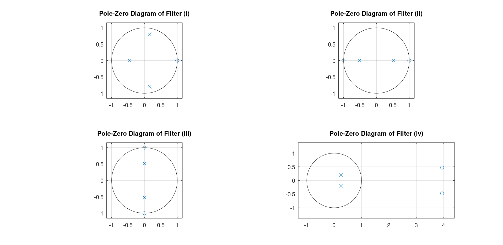

# DSP Assignment 1
Name: Conor Farrell

Student ID: 21359763

Course: 4BP1

## Q1
Determine the location of poles and calculate the centre frequency of the following transfer function:

$$ 
H(z) = \frac{1 + 0.5z^{-1}}
            {1 -1.8\cos{ \frac{\pi}{16} }z^{-1} +0.81z^{-2}}
$$

### Magnitude Response:


### Poles
*Poles in Cartesian:*

$$
0.88271 + j0.17558,  
0.88271 - j0.17558 
$$

*Poles in polar:*

$$
0.9e^{j0.1963}, 
0.9e^{-j0.1963}
$$

### Centre Frequency
Take the positive pole angle, calculate what proportion of 2pi it is and multiply by the sample frequency 

$$
\frac{0.1963}{2\pi} \cdot 16000 = 500 Hz
$$

### Pole Zero Diagram


### Code
``` MATLAB
clear
close all
% Define coefficients
Fs = 16000; % Sampling frequency in Hz
num = [1, 0.5];
den = [1, -1.8 * cos(pi/16), 0.81];

% Frequency response
N = 1024; % Number of points
[H, f] = freqz(num, den, N, Fs); % Compute the frequency response

% Plot magnitude response in dB
plot(f, 20*log10(abs(H)));
xlabel('Frequency (Hz)');
ylabel('Magnitude (dB)');
title('Magnitude Response');
grid on;

poles = roots(den) % Find the poles
polar_poles = abs(poles) % Magnitudes of the poles
angles_poles = angle(poles) % Angles of the poles in radians
F_centre = angles_poles/(2*pi)*Fs

% Plot pole zero map

% Find zeros and poles
zeros = roots(num);
poles = roots(den);

```
## Q2
Determine the transfer function, and hence calculate and plot the magnitude
response and impulse response, of a second-order filter that has a complex
conjugate pole pair with a pole frequency of 3.5 kHz, and pole radius of 0.95. The
filter also has a double zero at z = 0 in the z-plane. The sampling frequency is 20
kHz. For the magnitude response, use 2048 points equally spaced between DC and
half the sampling frequency. You should ensure that your plots have proper axes. 

### Determine Transfer Function:
*Determine Pole Angle:*

$$\omega = \frac{F_c}{F_s} \cdot 2\pi$$

$$\omega = \frac{3.5}{20} \cdot 2\pi = \frac{7\pi}{20}$$
 
*Determine Poles:*

$$
P_1 = 0.95e^{j\frac{7\pi}{20}}, 
P_2 = 0.95e^{j-\frac{7\pi}{20}}
$$

*Transfer Function:*

$$
H(x) = \frac{z^{-2}}
            {P_1 \cdot P_2 - (P_1 + P_2)z^{-1} + z^{-2}}
$$

### Magnitude and Impulse Response


This graph shows the response of a typical resonator filter

### Code
``` Matlab
clear all
close all

Fs = 20000;
poleFrequency = 3500;
poleRadius = 0.95;
size = 2048;

angle = poleFrequency/Fs*2*pi

% Get points of poles
pole1 = poleRadius*exp(1i*angle);
pole2 = poleRadius*exp(-1i*angle);

num = [1 0 0];
den = [1 -(pole1+pole2) pole1*pole2]

f = linspace(0, Fs/2, size);

w = 2*pi*f/Fs;

H = freqz(num, den, w);

magnitude = 20*log10(abs(H));

impulse = filter(num, den, [1 zeros(1, size-1)]);

figure;

subplot(2, 1, 1);
plot(f, magnitude);
grid on;
xlabel('Frequency (Hz)');
ylabel('Magnitude (dB)');
title('Magnitude Response');
xlim([0 Fs/2]);

subplot(2, 1, 2);
stem(impulse, 'MarkerSize', 2);
grid on;
xlabel('Time (samples)');
ylabel('Amplitude');
title('Impulse Response');
xlim([0 200]);

```
## Q3
For each of the following difference equations, calculate and plot the magnitude
response and the impulse response, and state what type of filter the difference
equation represents

1. $ y(n) + 0.13y(n-1) +0.52y(n-2) +0.3y(n-3) = 0.16x(n) - 0.48x(n-1) + 0.48x(n-2) - 0.16x(n-3)$
2. $ y(n) = 0.634x(n) - 0.634x(n-2) +0.268y(n-2)$
3. $ y(n) + 0.286y(n-2) = 0.634x(n) + 0.634x(n-2)$
4. $ 10y(n) - 5y(n-1) + y(n-2) = 0.634x(n) -5x(n-1) + 10x(n-2) $


### 1)
Convert the difference equation to a transfer function:

$$ y(n) + 0.13y(n-1) +0.52y(n-2) +0.3y(n-3) = 0.16x(n) - 0.48x(n-1) + 0.48x(n-2) - 0.16x(n-3)$$

*Apply the Z transform*

$$ Y(z) + 0.13Y(z)z^{-1} +0.52Y(z)z^{-2} +0.3Y(z)z^{-3} = 0.16X(z) + 0.48X(z)z^{-1} - 0.48X(z)z^{-2} - 0.16X(z)z^{-3}$$

*Group terms*

$$ Y(z)(1 + 0.13z^{-1} +0.52z^{-2} +0.3z^{-3}) = X(z)(0.16 - 0.48z^{-1} + 0.48z^{-2} - 0.16z^{-3}$$

$$
\frac{Y(z)}{X(z)} = H(z) = \frac{0.16 - 0.48z^{-1} + 0.48z^{-2} - 0.16z^{-3}}
                                {1 + 0.13z^{-1} +0.52z^{-2} +0.3z^{-3}}
$$


The response of the above filter appears to be a high pass filter. Attenuating the lower frequencies and allowing frequencies above 1 radian to pass

### 2)
Convert the difference equation to a transfer function:

$$ y(n) = 0.634x(n) - 0.634x(n-2) +0.268y(n-2)$$

*Apply the same steps from part 1*

$$
H(z) = \frac{0.634-0634z^{-2}}{1-0.268z^{-2}}
$$


The response of the above filter appears to be a band-gap filter, Allowing frequencies between 0.5 rad and 2.5 rad to pass.

### 3)
Convert the difference equation to a transfer function:

$$ y(n) + 0.286y(n-2) = 0.634x(n) + 0.634x(n-2)$$

*Apply the same steps from part 1*

$$
H(z) = \frac{0.634-0634z^{-2}}{1+0.268z^{-2}}
$$


The response of the above filter appears to be a notch filter, Attenuating frequencies between 1 rad and 2 rad.

##  4)
Convert the difference equation to a transfer function:

$$ 10y(n) - 5y(n-1) + y(n-2) = 0.634x(n) -5x(n-1) + 10x(n-2) $$

*Apply the same steps from part 1*

$$
H(z) = \frac{0.634 - 5z^{-1} + 10z^{-2}}
            {10 - 5z^-{-1} + z^{-2}}
$$

The above graph is hard to identify a filter type, there is minimal attenuation across all frequencies, it could be described as an all pass filter


With the phase response diagram the behaviour of the all pass filter is clear.


### Pole Zero Diagrams
Below is a graph showing the pole zero Diagrams for each function:


### Code
``` Matlab
clear all
close all
% Define numerator and denominator coefficients for (i)
num_i = [0.16 -0.48 0.48 -0.16];
den_i = [1 +0.13 +0.52 +0.3];

% Frequency Response
[H_i, w_i] = freqz(num_i, den_i);
magnitude_response_i = 20*log10(abs(H_i));

% Impulse Response
impulse_response_i = filter(num_i, den_i, [1 zeros(1, 100)]);

% Plot
figure;
subplot(2,1,1);
plot(w_i, magnitude_response_i);
title('Magnitude Response of Filter (i)');
xlabel('Frequency (rads)');
ylabel('Magnitude (dB)');
xlim([0 pi])
grid on;

subplot(2,1,2);
stem(impulse_response_i, 'MarkerSize', 2);
title('Impulse Response of Filter (i)');
xlabel('Sample Index');
ylabel('Amplitude');
xlim([0 20])
grid on;

% Define numerator and denominator coefficients for (ii)
num_ii = [0.634 0 -0.634];
den_ii = [1 0 -0.268];

% Frequency Response
[H_ii, w_ii] = freqz(num_ii, den_ii);
magnitude_response_ii = 20*log10(abs(H_ii));

% Impulse Response
impulse_response_ii = filter(num_ii, den_ii, [1 zeros(1, 100)]);

% Plot
figure;
subplot(2,1,1);
plot(w_ii, magnitude_response_ii);
title('Magnitude Response of Filter (ii)');
xlabel('Frequency (rads)');
ylabel('Magnitude (dB)');
xlim([0 pi])
grid on;

subplot(2,1,2);
stem(impulse_response_ii, 'MarkerSize', 2);
title('Impulse Response of Filter (ii)');
xlabel('Sample Index');
ylabel('Amplitude');
xlim([0 20])
grid on;

% Define numerator and denominator coefficients for (iii)
num_iii = [0.634 0 0.634];
den_iii = [1 0 0.268];

% Frequency Response
[H_iii, w_iii] = freqz(num_iii, den_iii);
magnitude_response_iii = 20*log10(abs(H_iii));

% Impulse Response
impulse_response_iii = filter(num_iii, den_iii, [1 zeros(1, 100)]);

% Plot
figure;
subplot(2,1,1);
plot(w_iii, magnitude_response_iii);
title('Magnitude Response of Filter (iii)');
xlabel('Frequency (rads)');
ylabel('Magnitude (dB)');
grid on;
xlim([0 pi])

subplot(2,1,2);
stem(impulse_response_iii,'MarkerSize', 2);
title('Impulse Response of Filter (iii)');
xlabel('Sample Index');
ylabel('Amplitude');
xlim([0 20])
grid on;

% Define numerator and denominator coefficients for (iv)
num_iv = [0.634 -5 10];
den_iv = [10 -5 1];

% Frequency Response
[H_iv, w_iv] = freqz(num_iv, den_iv);
magnitude_response_iv = 20*log10(abs(H_iv));

% Impulse Response
impulse_response_iv = filter(num_iv, den_iv, [1 zeros(1, 100)]);

% Plot
figure;
subplot(2,1,1);
plot(w_iv, magnitude_response_iv);
title('Magnitude Response of Filter (iv)');
xlabel('Frequency (rads)');
ylabel('Magnitude (dB)');
xlim([0 pi])
grid on;

subplot(2,1,2);
stem(impulse_response_iv, 'MarkerSize', 2);
title('Impulse Response of Filter (iv)');
xlabel('Sample Index');
ylabel('Amplitude');
xlim([0 20])
grid on;


% Plot Phase Response for all filters
figure;

% Phase Response for Filter (i)
subplot(2,2,1);
plot(w_i, angle(H_i));
title('Phase Response of Filter (i)');
xlabel('Frequency (rads)');
ylabel('Phase (radians)');
grid on;
xlim([0 pi])

% Phase Response for Filter (ii)
subplot(2,2,2);
plot(w_ii, angle(H_ii));
title('Phase Response of Filter (ii)');
xlabel('Frequency (rads)');
ylabel('Phase (radians)');
grid on;
xlim([0 pi])

% Phase Response for Filter (iii)
subplot(2,2,3);
plot(w_iii, angle(H_iii));
title('Phase Response of Filter (iii)');
xlabel('Frequency (rads)');
ylabel('Phase (radians)');
grid on;
xlim([0 pi])

% Phase Response for Filter (iv)
subplot(2,2,4);
plot(w_iv, angle(H_iv));
title('Phase Response of Filter (iv)');
xlabel('Frequency (rads)');
ylabel('Phase (radians)');
grid on;
xlim([0 pi])

% Plot Pole-Zero Diagrams for all filters
figure;

% Pole-Zero Diagram for Filter (i)
subplot(2,2,1);
zplane(num_i, den_i);
title('Pole-Zero Diagram of Filter (i)');
grid on;

% Pole-Zero Diagram for Filter (ii)
subplot(2,2,2);
zplane(num_ii, den_ii);
title('Pole-Zero Diagram of Filter (ii)');
grid on;

% Pole-Zero Diagram for Filter (iii)
subplot(2,2,3);
zplane(num_iii, den_iii);
title('Pole-Zero Diagram of Filter (iii)');
grid on;

% Pole-Zero Diagram for Filter (iv)
subplot(2,2,4);
zplane(num_iv, den_iv);
title('Pole-Zero Diagram of Filter (iv)');
grid on;
```

